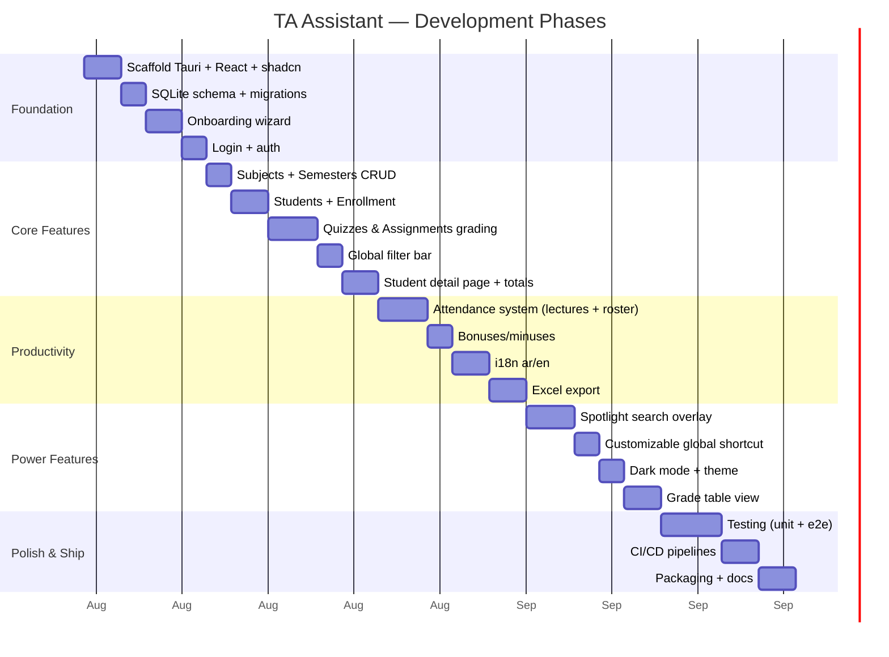

# TA Assistant — Design & Plan

> A local-first, open-source desktop app for university teaching assistants.
> Track students, grades, attendance, and bonuses — all offline, all yours.

---

## Table of Contents

1. [Philosophy](#1-philosophy)
2. [Tech Stack](#2-tech-stack)
3. [Data Model](#3-data-model)
4. [Architecture & Directory Structure](#4-architecture--directory-structure)
5. [UI/UX Design](#5-uiux-design)
6. [Features by Priority](#6-features-by-priority)
7. [Onboarding Flow](#7-onboarding-flow)
8. [Security & Privacy](#8-security--privacy)
9. [Internationalization (i18n)](#9-internationalization-i18n)
10. [Excel Export](#10-excel-export)
11. [Production Readiness](#11-production-readiness)
12. [Development Roadmap](#12-development-roadmap)

---

## 1. Philosophy

- **Local-first.** Zero cloud dependency. SQLite file lives on the user's machine.
- **Privacy-first.** Password is hashed locally with Argon2. No telemetry. No accounts.
- **Open source.** MIT licensed. Any TA anywhere can use, modify, or contribute.
- **Keyboard-first.** Speed during lectures matters. Global search overlay, keyboard navigation.
- **Offline.** Fully functional without internet. Excel export works locally.

---

## 2. Tech Stack

| Layer | Technology | Justification |
|-------|-----------|---------------|
| **Desktop Framework** | Tauri 2.0 | Tiny binaries (≈5MB), Rust backend, system tray, native file dialogs |
| **Frontend** | React 19 + TypeScript | Mature ecosystem, type safety |
| **Styling** | Tailwind CSS v4 + shadcn/ui | Rapid UI, accessible components, themeable |
| **State Management** | Zustand | Lightweight, TypeScript-first, no boilerplate |
| **Routing** | React Router v7 | File-route-inspired nested layouts |
| **Tables** | TanStack Table (React) | Virtual scrolling, sorting, filtering, editable cells |
| **Fuzzy Search** | Fuse.js | Lightweight, client-side fuzzy matching for global search |
| **i18n** | react-i18next + i18next | Mature, supports RTL, lazy-loaded namespaces |
| **Animations** | Framer Motion | Subtle transitions, overlay animations |
| **Database** | SQLite (via `tauri-plugin-sql`) | Embedded, zero-config, portable |
| **Excel Export** | `rust_xlsxwriter` (Rust crate) | Production-grade xlsx with formatting |
| **Password Hashing** | `argon2` (Rust crate) | Industry-standard KDF |
| **Global Shortcut** | `tauri-plugin-global-shortcut` | System-wide hotkey for search overlay |
| **Build Tool** | Vite | Fast HMR, optimized builds |

### Why not…

- **Electron?** Heavier (≈150MB), more memory. Tauri is 20-30x smaller.
- **Electron + BetterSQLite3?** Valid, but more complex packaging. Tauri's Rust-backed SQLite is cleaner.
- **PWA?** No global shortcut, no system tray, no native file dialogs. Desktop-only features are table stakes.
- **LocalStorage / IndexedDB?** Not suitable for complex relational queries, aggregations, or portable backups.

---

## 3. Data Model

```sql
-- Core identity
CREATE TABLE users (
    id          TEXT PRIMARY KEY,
    name        TEXT NOT NULL,
    email       TEXT NOT NULL UNIQUE,
    password    TEXT NOT NULL,          -- argon2 hash
    locale      TEXT NOT NULL DEFAULT 'en',
    created_at  TEXT NOT NULL DEFAULT (datetime('now'))
);

-- Academic structure
CREATE TABLE semester_years (
    id          TEXT PRIMARY KEY,
    year        INTEGER NOT NULL,       -- 2026
    semester    TEXT NOT NULL,           -- 'Fall' | 'Spring' | 'Summer'
    UNIQUE(year, semester)
);

CREATE TABLE subjects (
    id          TEXT PRIMARY KEY,
    name        TEXT NOT NULL,           -- 'Data Structures'
    code        TEXT,                    -- 'CS101'
    color       TEXT                     -- hex for UI badge
);

-- Students & enrollment
CREATE TABLE students (
    id          TEXT PRIMARY KEY,
    name        TEXT NOT NULL,
    email       TEXT,
    created_at  TEXT NOT NULL DEFAULT (datetime('now'))
);

CREATE TABLE enrollments (
    id              TEXT PRIMARY KEY,
    student_id      TEXT NOT NULL REFERENCES students(id) ON DELETE CASCADE,
    semester_year_id TEXT NOT NULL REFERENCES semester_years(id) ON DELETE CASCADE,
    subject_id      TEXT NOT NULL REFERENCES subjects(id) ON DELETE CASCADE,
    UNIQUE(student_id, semester_year_id, subject_id)
);

-- Grading
CREATE TABLE quizzes (
    id              TEXT PRIMARY KEY,
    enrollment_id   TEXT NOT NULL REFERENCES enrollments(id) ON DELETE CASCADE,
    name            TEXT NOT NULL,       -- 'Quiz 1'
    max_score       REAL NOT NULL,
    score           REAL,               -- nullable until graded
    date            TEXT
);

CREATE TABLE assignments (
    id              TEXT PRIMARY KEY,
    enrollment_id   TEXT NOT NULL REFERENCES enrollments(id) ON DELETE CASCADE,
    name            TEXT NOT NULL,       -- 'HW 1'
    max_score       REAL NOT NULL,
    score           REAL,               -- nullable until graded
    description     TEXT,
    due_date        TEXT
);

-- Attendance
CREATE TABLE lectures (
    id              TEXT PRIMARY KEY,
    subject_id      TEXT NOT NULL REFERENCES subjects(id) ON DELETE CASCADE,
    semester_year_id TEXT NOT NULL REFERENCES semester_years(id) ON DELETE CASCADE,
    title           TEXT,                -- 'Lecture 1' or custom
    date            TEXT NOT NULL,
    UNIQUE(subject_id, semester_year_id, date)
);

CREATE TABLE attendance (
    id              TEXT PRIMARY KEY,
    lecture_id      TEXT NOT NULL REFERENCES lectures(id) ON DELETE CASCADE,
    enrollment_id   TEXT NOT NULL REFERENCES enrollments(id) ON DELETE CASCADE,
    status          TEXT NOT NULL CHECK(status IN ('present','absent','late','excused')),
    UNIQUE(lecture_id, enrollment_id)
);

-- Bonuses & deductions
CREATE TABLE bonuses (
    id              TEXT PRIMARY KEY,
    enrollment_id   TEXT NOT NULL REFERENCES enrollments(id) ON DELETE CASCADE,
    value           REAL NOT NULL,       -- positive = bonus, negative = deduction
    reason          TEXT NOT NULL,       -- 'Participation', 'Late submission'
    date            TEXT NOT NULL DEFAULT (datetime('now'))
);

-- Settings
CREATE TABLE settings (
    key             TEXT PRIMARY KEY,
    value           TEXT NOT NULL
);

-- Seed default settings
INSERT OR IGNORE INTO settings (key, value) VALUES ('global_shortcut', 'Ctrl+Shift+P');
INSERT OR IGNORE INTO settings (key, value) VALUES ('locale', 'en');
INSERT OR IGNORE INTO settings (key, value) VALUES ('auto_lock_minutes', '0');
```

### Key Design Decisions

- **UUIDs as primary keys** (`crypto.randomUUID()`) — avoid autoincrement guessability, safe for export/import merging.
- **Denormalized `score` on quizzes/assignments** — single source of truth per graded item. Separate `max_score` avoids schema changes when a quiz gets re-graded.
- **`enrollments` as the central join** — a student's grades/attendance/bonuses are all tied to their enrollment in a specific subject+semester, not to the student directly.
- **`lectures` are per-course, not per-enrollment** — one lecture, many attendance records. Clean and efficient.
- **CHECK constraints** on status — enforce data integrity at the DB level.

---

## 4. Architecture & Directory Structure

```
ta-assistant/
├── src-tauri/                    # Rust backend
│   ├── src/
│   │   ├── main.rs               # Tauri entry point, plugin registration
│   │   ├── lib.rs                # Crate root
│   │   ├── db/
│   │   │   ├── mod.rs
│   │   │   ├── migrations.rs     # Schema migrations (embedded SQL)
│   │   │   └── seed.rs           # Default settings seed
│   │   ├── commands/             # #[tauri::command] handlers
│   │   │   ├── mod.rs
│   │   │   ├── students.rs
│   │   │   ├── subjects.rs
│   │   │   ├── grades.rs
│   │   │   ├── attendance.rs
│   │   │   ├── bonuses.rs
│   │   │   ├── search.rs         # Global search endpoint
│   │   │   ├── excel.rs          # Export logic
│   │   │   └── settings.rs
│   │   ├── models/               # Serde-serializable structs
│   │   │   ├── mod.rs
│   │   │   └── *.rs
│   │   ├── excel/                # xlsx generation
│   │   │   ├── mod.rs
│   │   │   └── export.rs
│   │   └── auth/                 # Password hashing, session
│   │       ├── mod.rs
│   │       └── hash.rs
│   ├── migrations/               # Raw SQL migration files
│   │   ├── 001_initial.sql
│   │   └── 002_*.sql
│   ├── icons/                    # App icons (all platforms)
│   ├── tauri.conf.json
│   └── Cargo.toml
│
├── src/                          # React frontend
│   ├── main.tsx                  # Entry point
│   ├── App.tsx                   # Root layout, filter bar, router
│   ├── routes/
│   │   ├── index.tsx             # Route definitions
│   │   ├── onboarding.tsx        # First-launch wizard
│   │   ├── login.tsx             # Password gate (returning user)
│   │   ├── dashboard.tsx
│   │   ├── students.tsx          # Student list + detail
│   │   ├── grades.tsx            # Grade table
│   │   ├── attendance.tsx        # Lecture management
│   │   └── settings.tsx          # Preferences, shortcuts
│   ├── components/
│   │   ├── ui/                   # shadcn primitives (button, dialog, table, etc.)
│   │   ├── layout/
│   │   │   ├── top-bar.tsx       # Global filter dropdowns
│   │   │   ├── sidebar.tsx       # Navigation
│   │   │   └── shell.tsx         # Main layout wrapper
│   │   ├── search/
│   │   │   ├── spotlight.tsx     # Global search overlay
│   │   │   └── search-result.tsx
│   │   ├── student/
│   │   │   ├── student-list.tsx
│   │   │   ├── student-detail.tsx
│   │   │   └── student-form.tsx
│   │   ├── grades/
│   │   │   ├── grade-table.tsx
│   │   │   ├── quiz-form.tsx
│   │   │   └── assignment-form.tsx
│   │   ├── attendance/
│   │   │   ├── lecture-roster.tsx
│   │   │   ├── lecture-form.tsx
│   │   │   └── attendance-matrix.tsx
│   │   ├── bonuses/
│   │   │   └── bonus-form.tsx
│   │   └── shared/
│   │       ├── empty-state.tsx
│   │       ├── loading-state.tsx
│   │       └── error-boundary.tsx
│   ├── hooks/
│   │   ├── use-db.ts             # Tauri SQL hooks
│   │   ├── use-filter.ts         # Global filter state
│   │   ├── use-search.ts         # Spotlight search
│   │   └── use-shortcut.ts       # Global shortcut listener
│   ├── stores/
│   │   ├── filter-store.ts       # Zustand — year/semester/subject
│   │   ├── auth-store.ts         # Zustand — auth state
│   │   └── ui-store.ts           # Zustand — sidebar, theme, etc.
│   ├── i18n/
│   │   ├── index.ts              # i18n setup
│   │   ├── locales/
│   │   │   ├── en/
│   │   │   │   ├── common.json
│   │   │   │   ├── students.json
│   │   │   │   ├── grades.json
│   │   │   │   └── settings.json
│   │   │   └── ar/
│   │   │       ├── common.json
│   │   │       ├── students.json
│   │   │       ├── grades.json
│   │   │       └── settings.json
│   │   └── rtl.tsx               # RTL provider component
│   ├── lib/
│   │   ├── db.ts                 # Typed wrappers around tauri-plugin-sql
│   │   └── utils.ts              # cn(), formatting helpers
│   └── types/
│       └── index.ts              # Shared TypeScript types
│
├── public/
│   └── icons/                    # Static assets
│
├── tests/                        # Playwright e2e + Vitest unit
│   ├── e2e/
│   │   ├── onboarding.spec.ts
│   │   └── students.spec.ts
│   └── unit/
│       └── ...
│
├── scripts/
│   └── seed.ts                   # Development seed data script
│
├── .github/
│   └── workflows/
│       ├── ci.yml                # Build + lint + test on PR
│       └── release.yml           # Draft release with binaries
│
├── .env.example
├── .gitignore
├── biome.json                    # Linting & formatting (Biome)
├── tailwind.config.ts
├── tsconfig.json
├── vite.config.ts
├── package.json
├── Cargo.toml                    # (symlinked or workspace)
├── README.md
├── LICENSE
└── CONTRIBUTING.md
```

---

## 5. UI/UX Design

### Design System

- **Tokens:** Tailwind + CSS variables for theme colors (light/dark mode)
- **Components:** shadcn/ui (Radix primitives — accessible, keyboard-navigable)
- **Typography:** System font stack for zero-bloat
- **Icons:** Lucide React (simple, consistent, tree-shakable)
- **Dark mode:** Built-in from day one via Tailwind `class` strategy + `<ThemeProvider>`

### Layout

```
┌─────────────────────────────────────────────────────┐
│  🐼 TA Assistant    [Year ▼] [Sem ▼] [Subj ▼]  🔍  │  ← Top bar
├─────────┬───────────────────────────────────────────┤
│         │                                           │
│  📊     │           [Page Content]                  │
│  👥     │                                           │
│  📝     │                                           │
│  🪑     │                                           │
│  ⚙️     │                                           │
│         │                                           │
├─────────┴───────────────────────────────────────────┤
│  [Student name] — CS101 Fall 2026            [🌙]   │  ← Status bar
└─────────────────────────────────────────────────────┘
```

- **Left sidebar:** icon-based navigation (collapsible, tooltip-labeled)
- **Top bar:** Global filter chain that persists across routes
- **Status bar:** Current context, quick student info, locale/theme toggle

### Spotlight Overlay

Triggered by global shortcut → full-screen translucent overlay:

```
┌─────────────────────────────────────────────────────┐
│  🔍 Search all students, subjects…                   │
│  ─────────────────────────────────────────────────── │
│  ahmed                                               │
│                                                      │
│  👤 Ahmed Hassan                                     │
│     CS101 — Fall 2026                                │
│     MATH201 — Fall 2026                              │
│  👤 Ahmed Ali                                        │
│     CS101 — Fall 2026                                │
│  📚 CS101 — Data Structures (Fall 2026)              │
│                                                      │
│  [Type to search... Esc to close]                    │
└─────────────────────────────────────────────────────┘
```

### Flow States

Every data view handles four states:

1. **Loading** — Skeleton placeholders (no spinners)
2. **Empty** — Illustrative empty state with CTA ("Add your first student")
3. **Error** — Inline error with retry button
4. **Data** — Normal rendering

---

## 6. Features by Priority

### Phase 1 — Core (MVP)

- [ ] App scaffolding (Tauri + React + Tailwind + shadcn)
- [ ] SQLite database with migrations
- [ ] Onboarding wizard (language, profile, password)
- [ ] Login screen with password verification
- [ ] Semester/Year/Subject CRUD
- [ ] Student CRUD (add to enrollment)
- [ ] Quiz creation + grade entry
- [ ] Assignment creation + grade entry
- [ ] Student detail page (quizzes, assignments, total sum)
- [ ] Global filter chain (year → semester → subject)
- [ ] Lecture creation + attendance roster
- [ ] Bonus/minus CRUD
- [ ] Excel export with formatting
- [ ] i18n (ar/en) — full localization

### Phase 2 — Productivity

- [ ] Global spotlight search (Ctrl+Shift+P)
- [ ] Customizable global shortcut via Settings
- [ ] Student search across all semesters/subjects
- [ ] Grade table view (students as rows, quizzes/assignments as columns)
- [ ] Quick-add bonus from student detail
- [ ] Attendance summary per student (% calculation)
- [ ] Export filtered data (current filter context)
- [ ] Dark mode
- [ ] Inline editing in grade table

### Phase 3 — Polish & Scale

- [ ] Data backup/restore
- [ ] CSV import for rosters
- [ ] Attendance matrix (all lectures × all students)
- [ ] Grade analytics (class average, median, distribution)
- [ ] System tray minimize + quick actions
- [ ] App auto-lock on inactivity
- [ ] Keyboard shortcuts guide (`?` overlay)
- [ ] CI/CD pipeline (GitHub Actions)
- [ ] Windows + macOS + Linux builds

---

## 7. Onboarding Flow

### First Launch

```
┌────────────────────────────────────────────┐
│  👋 Welcome to TA Assistant!               │
│                                            │
│  🌐 Choose your language                   │
│  [English]  [العربية]                      │
│                                            │
│  ─── Step 1 of 3 ───                      │
│                                            │
│  [→ Next]                                 │
└────────────────────────────────────────────┘

┌────────────────────────────────────────────┐
│  👤 About You                              │
│                                            │
│  Full name:  [____________________]        │
│  Email:      [____________________]        │
│                                            │
│  ─── Step 2 of 3 ───                      │
│                                            │
│  [← Back]  [→ Next]                       │
└────────────────────────────────────────────┘

┌────────────────────────────────────────────┐
│  🔐 Create a Password                      │
│                                            │
│  Password:      [________________]         │
│  Confirm:       [________________]         │
│                                            │
│  This unlocks your TA data locally.        │
│  No cloud. No telemetry. Just you.         │
│                                            │
│  ─── Step 3 of 3 ───                      │
│                                            │
│  [← Back]  [✨ Get Started]               │
└────────────────────────────────────────────┘
```

### Returning User

Password screen → No registration (single-user app). Decorate with a subtle "Forgot password? Your data is unrecoverable without it — keep it safe." (Zero-knowledge design.)

---

## 8. Security & Privacy

| Concern | Mitigation |
|---------|-----------|
| **Data at rest** | SQLite file with no encryption by default (portable). Optional: SQLCipher via custom Tauri plugin in future. |
| **Access control** | Password gate on app launch. Argon2id hashing (memory-hard, resistant to GPU attacks). |
| **Global shortcut** | Only registered when app is active (configurable, can disable). |
| **Telemetry** | **None.** Zero analytics, zero crash reporters, zero phone-home. |
| **Open source** | Anyone can audit the code. No binary blobs. |
| **Data portability** | SQLite file is a single file. Copy it, back it up, sync it. |
| **Excel export** | Generated locally, never transmitted. |

### Password Handling

1. User sets password during onboarding
2. Rust uses `argon2` crate with Argon2id variant, salt auto-generated
3. Hash stored in `users` table alongside name/email
4. On login, password is verified against the hash
5. **No password recovery** — if forgotten, user can delete the DB and start fresh. This is intentionally stated upfront.

---

## 9. Internationalization (i18n)

### Strategy

- **react-i18next** with **lazy namespace loading** (split by page/domain)
- Namespace per page/domain: `common`, `students`, `grades`, `attendance`, `onboarding`, `settings`
- Locale stored in SQLite `settings` table + Zustand for reactive UI
- RTL support via `dir="rtl"` attribute on `<html>` + Tailwind RTL utilities (`rtl:` prefix)
- Numbers/LTR text in RTL mode handled with `unicode-bidi: isolate` and `dir="ltr"` inline when needed

### i18n File Structure

```
src/i18n/locales/
├── en/
│   ├── common.json        # App-wide strings, navigation, actions
│   ├── onboarding.json    # Setup wizard
│   ├── students.json      # Student list, detail, forms
│   ├── grades.json        # Quizzes, assignments, totals
│   ├── attendance.json    # Lectures, roster, statuses
│   └── settings.json      # Preferences, shortcuts
└── ar/
    ├── common.json
    ├── onboarding.json
    ├── students.json
    ├── grades.json
    ├── attendance.json
    └── settings.json
```

### Implementation Details

- `i18next-browser-languagedetector` with localStorage fallback
- Translation function: `t('namespace:key')` or `useTranslation('namespace')`
- Date formatting: `Intl.DateTimeFormat` with user's locale
- Number formatting: `Intl.NumberFormat` for grade display
- RTL-aware animations: Framer Motion `dir`-conditional `x` values

---

## 10. Excel Export

### Library: `rust_xlsxwriter`

Production-grade, actively maintained, pure Rust xlsx writer with full formatting support.

### Formatting Design

| Element | Style |
|---------|-------|
| **Title row** | Bold, 14pt, centered, merged across columns |
| **Header row** | Bold, colored background (`#4472C4`), white text, border |
| **Student name column** | Bold, left-aligned, wider width |
| **Score cells** | Right-aligned, number format `0.0` or `0.00` |
| **Alternating rows** | Light blue/white banding for readability |
| **Total column** | Bold, formula-based (`SUM`), right-aligned |
| **Attendance** | Conditional fill (green/red/amber) for statuses |
| **Column widths** | Auto-fit based on content or sensible defaults |
| **Freeze pane** | Header row + student name column frozen |

### Export Output Example

One sheet per subject (when no filter) or single sheet (when filter is active):

| Student | Quiz 1 (5) | Quiz 2 (10) | HW 1 (10) | Bonus | Total |
|---------|-----------|------------|----------|-------|-------|
| Ahmed Hassan | 4.0 | 8.0 | 9.0 | +2 | 23/25 |
| Sara Ali | 5.0 | 9.0 | 8.5 | 0 | 22.5/25 |

### Column Configuration

Sheet header includes `(Max: N)` hints for each graded item. Invisible metadata row in the xlsx (hidden, or in a separate "Metadata" sheet) stores the schema version for future import compatibility.

---

## 11. Production Readiness

### Code Quality

- **TypeScript strict mode** — `strict: true`, no `any` where avoidable
- **Biome** for linting + formatting (fast, unified Rust-based tool)
- **Rust clippy** — pedantic lint level
- **Husky + lint-staged** — pre-commit hooks for formatting + linting
- **Conventional commits** — `feat:`, `fix:`, `chore:`, `docs:`, etc.

### Testing

| Layer | Tool | Scope |
|-------|------|-------|
| **Unit (frontend)** | Vitest + React Testing Library | Components, hooks, stores |
| **Unit (backend)** | Rust `cargo test` | Commands, models, excel export |
| **E2E** | Playwright + WebDriver (Tauri) | Onboarding, CRUD flows |
| **DB migrations** | Rust tests with temp SQLite files | Up/down migration integrity |

### CI/CD (GitHub Actions)

```yaml
# .github/workflows/ci.yml
- Lint (Biome + clippy)
- Typecheck (tsc --noEmit)
- Test (Vitest + cargo test)
- Build (cargo tauri build --ci)

# .github/workflows/release.yml
- On tag: build for Windows (MSI), macOS (DMG), Linux (AppImage/deb)
- Draft GitHub Release with binaries + checksums
```

### Error Handling

- **Frontend:** React Error Boundary per route, generic fallback with "Reload" + "Report" buttons
- **Rust commands:** Return `Result<T, String>` with descriptive error messages, surfaced as toast notifications
- **DB errors:** Logged to stderr, non-fatal errors shown as inline warnings
- **App crashes:** Crash-free session tracking via simple file counter (zero telemetry — just local awareness)

### Performance

- **TanStack Table** virtual rows for large grade tables (>1000 students)
- **SQLite indexes** on `enrollments(student_id)`, `enrollments(semester_year_id, subject_id)`, `attendance(lecture_id)`
- **Debounced search** (300ms) in spotlight overlay
- **Lazy-loaded i18n namespaces** — only load what the current page needs
- **Tauri sidecar:** Heavy operations (Excel export) in separate Rust thread, progress callbacks via Tauri events

### Accessibility

- shadcn/ui Radix primitives are ARIA-compliant
- All interactive elements keyboard-accessible
- Focus management in overlays (trap focus, restore on close)
- `prefers-reduced-motion` respected (Framer Motion)

---

## 12. Development Roadmap



---

## Licensing

**MIT License** — Free for any TA, anywhere. Use it, modify it, redistribute it. Attribution appreciated but not required.

```
MIT License

Copyright (c) 2026 Abdullah (PandaX185)

Permission is hereby granted, free of charge, to any person obtaining a copy
of this software and associated documentation files...
```

---

## Project Files to Create Immediately

After this plan is approved, these are the first files:

| File | Purpose |
|------|---------|
| `README.md` | Project overview, badges, setup instructions |
| `LICENSE` | MIT license text |
| `.gitignore` | Rust + Node + Tauri + OS artifacts |
| `biome.json` | Linter + formatter config |
| `package.json` | Frontend deps + scripts |
| `tsconfig.json` | TypeScript config |
| `vite.config.ts` | Vite config (Tauri-aware) |
| `src-tauri/Cargo.toml` | Rust deps |
| `src-tauri/tauri.conf.json` | Tauri configuration (window, permissions, plugins) |
| `src-tauri/migrations/001_initial.sql` | Initial schema |

---

> **Status:** Brainstorming complete. Ready for implementation planning.
> **Next step:** Transition to `/feat` workflow — create `plan/feat-ta-assistant-core.md` with sprint-level breakdown.
